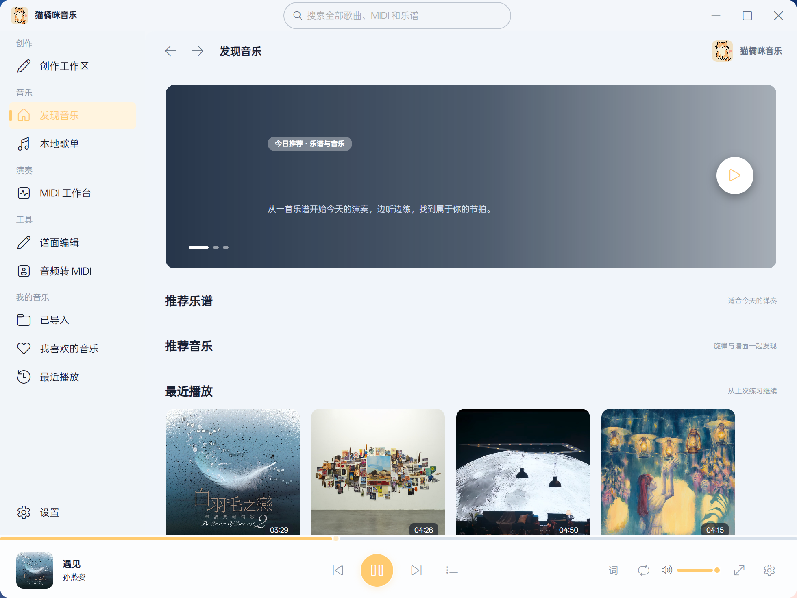
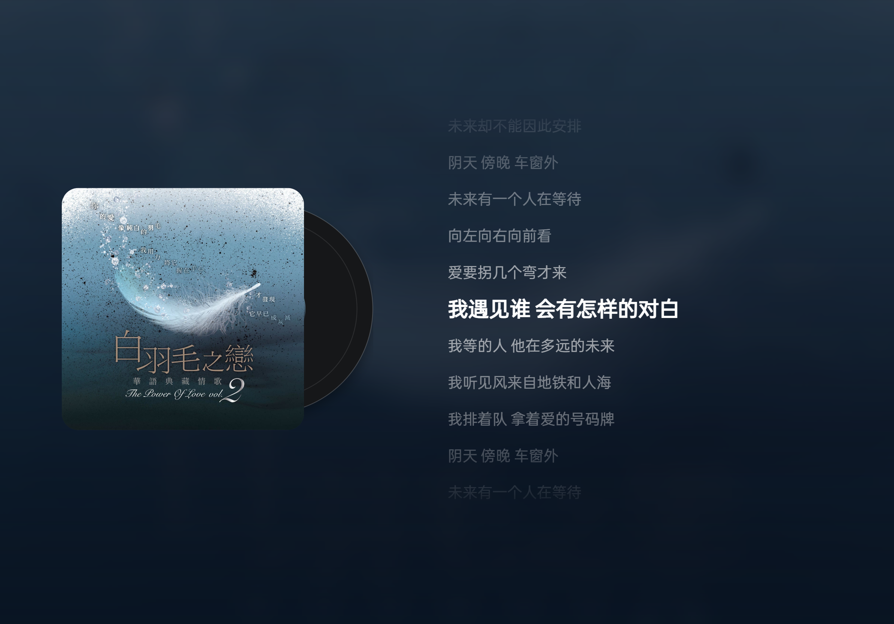
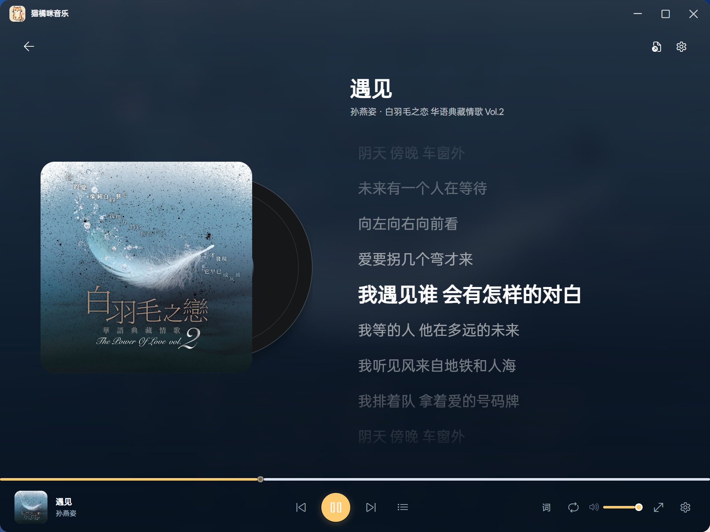
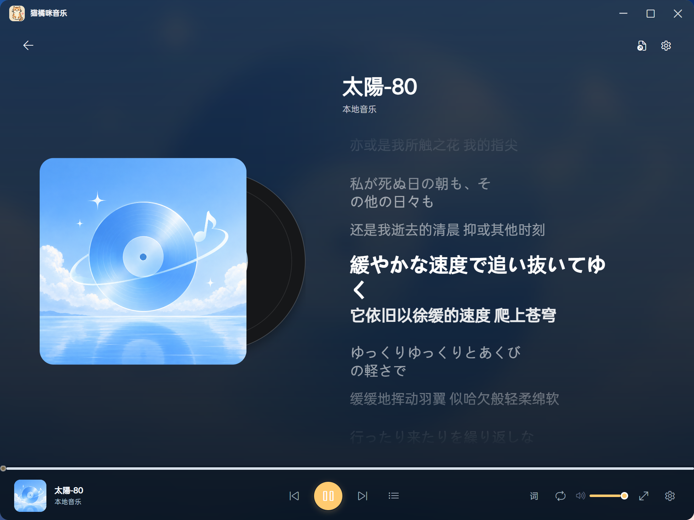
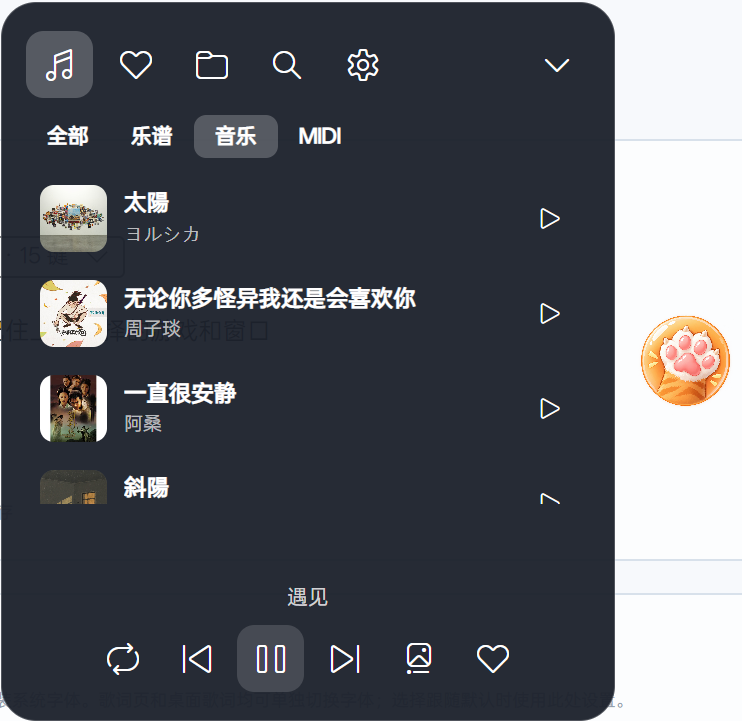
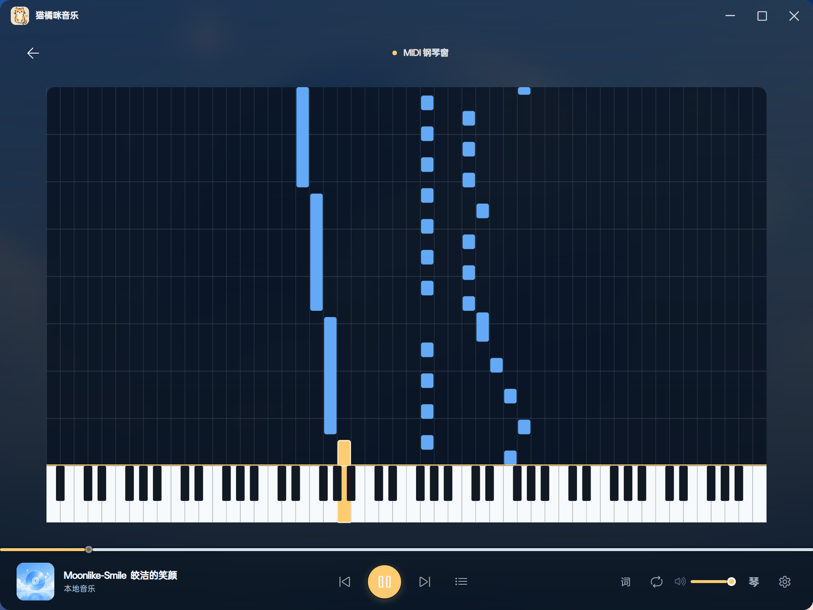
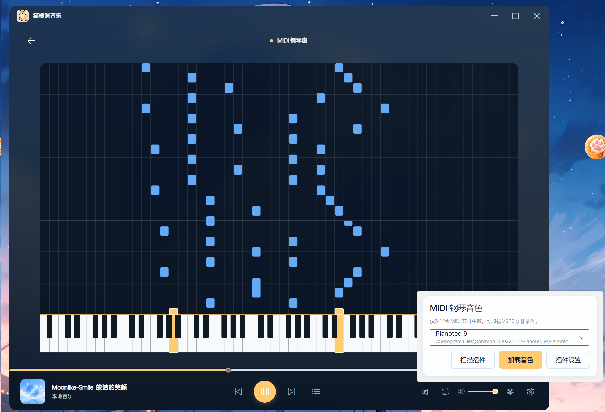
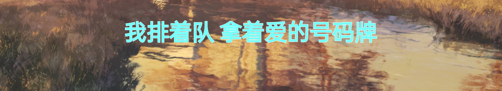
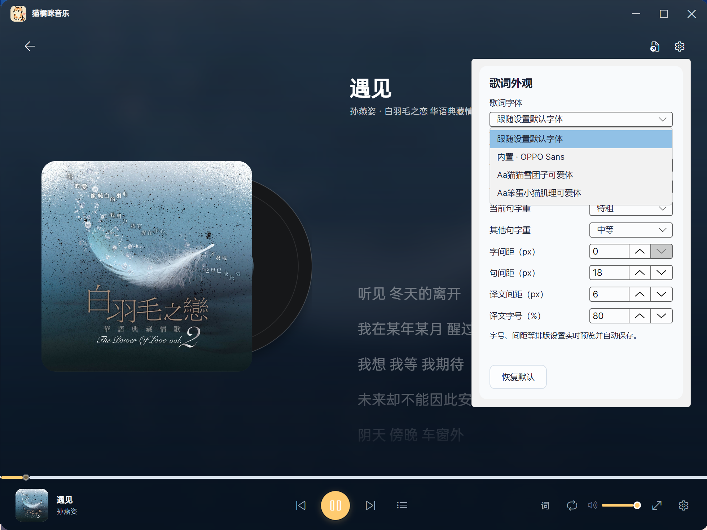
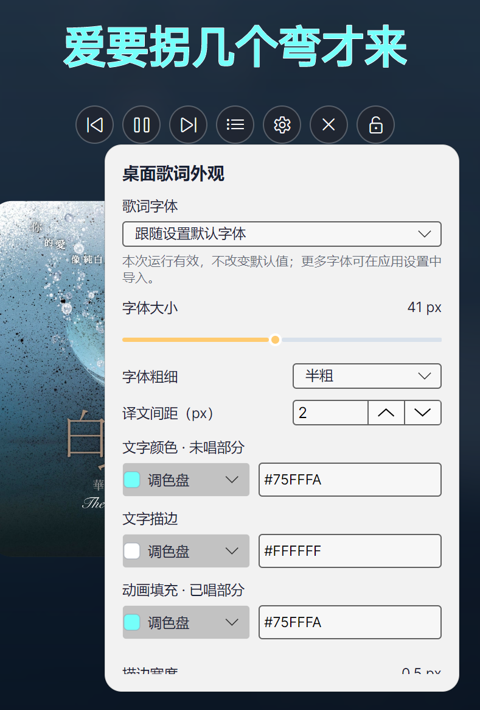

# 预览图
## 主页
------------

## 全屏歌词
------------

## 播放页
------------

## 乐谱歌词
------------

## 悬浮窗
------------

## midi播放
------------

## VST3插件音色
------------

## 桌面歌词
------------

## 自定义歌词字体
------------

